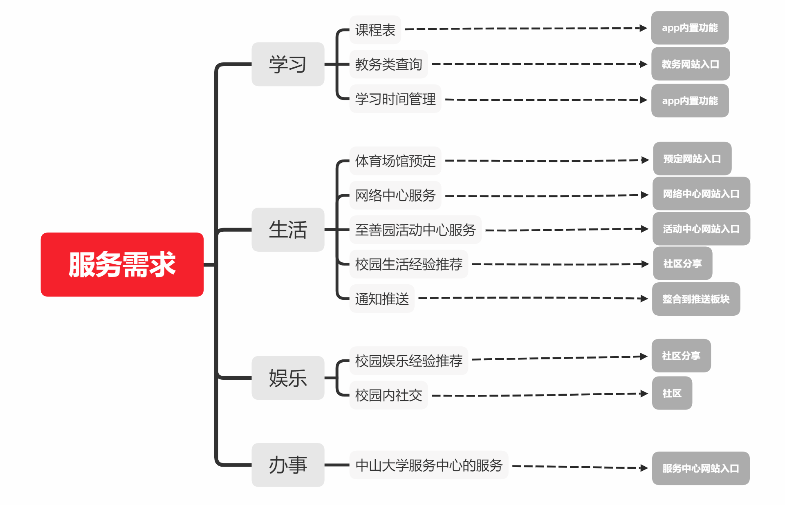
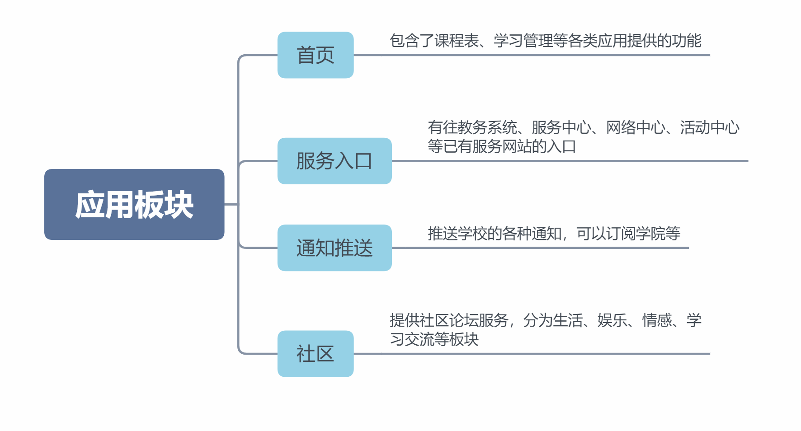

## program介绍

如上文所说，中山大学对学生提供的服务分散在各个官方平台，且很多在移动端都无入口，还需要自己打开不适配移动端的网站去找；也没有一个统一的获取信息平台；加上我们觉得中大没有一个可以用来分享生活、娱乐经验的面向校内社区。因此我们打算做一个移动端的应用，将服务系统入口、信息推送、社区以及其他实用服务功能整合一起。    

首先我们依旧分类将服务的需求以及实现整理出来。

然后我们将整个应用的实现分为4个板块

这就是我们提出的一个服务综合类应用

